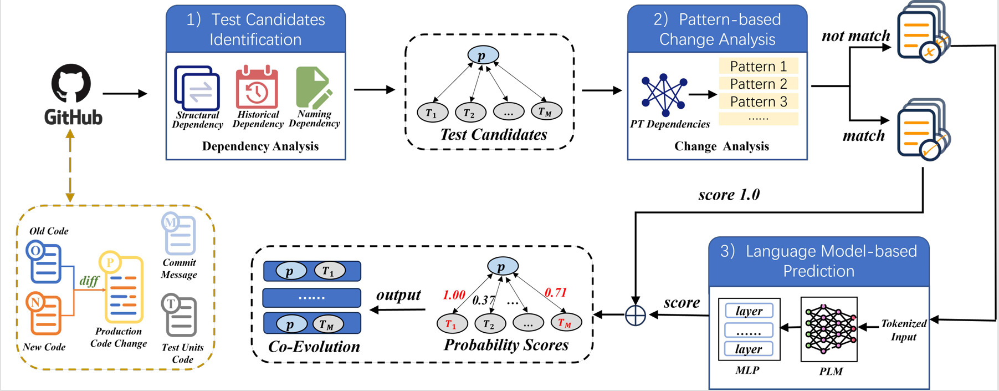

# _COTE_

_**COTE**_ (_**CO**de-to-**T**est co-**E**volution_), a hybrid approach which combines pattern- and PLM-based techniques, to predict code-to-test co-evolution.

<p align="center">
  <span style="font-size: 20px; font-weight: bold;">Overview of COTE</span>
</p>
<p align="center">
  
</p>

## 1. Model training and validation

### Environment

    antlr4-python3-runtime    4.8
    python                    3.8.19
    torch                     1.10.1+cu113
    torchaudio                0.10.1+cu113
    torchvision               0.11.2+cu113

Our method is based on pytorch. The core code is placed in the COTE folder. The important files are as follows:

- **code_to_seq.py**: Generate production change code sequence
- **config.py**: Model configuration files
- **data.py**: Process the incoming data and generate dataloader
- **main.py**: Configure and train the model based on incoming data
- **eval.py**: Select the best model for verification
- **model.py**: Model architecture of COTE

To train our model, you need to do the following:

```
STEP1: download the PLM weight file in the ./COTE/model/ folder
STEP2: Use our data or your data to divide the training set and validation set, and configure the path in the config file
STEP3: python main.py --model_name "the PLM you use"
```

To evluate our model, please use the following scripts:

```
STEP4: python eval.py --model_name "the PLM you use"
```

The implementation of the baseline method can be found at https://github.com/CEPROTest/CEPROT

## 02. About the Data

We have placed all the data collected and reviewed during the experiment in the ./data/ directory.
The groundtruth folder contains the collected ground truth data and its review results, while the Manual Analysis folder contains the review results for FN and FP related to RQ4. Additionally, we have collected datasets for projects with fewer stars, which are stored in the 'Low-starred Projects' folder.

All files are presented in the form of json files. Their common keys represent the following meanings:

- **rep_name**: The name of the github repository to which the sample belongs
- **commit**: The hash value of the commit
- **commit_message**: Commit message for the commit
- **p_path**: Path to production file
- **t_path**: Path to test file
- **p_name**: Lowercase form of the production function name
- **t_name**: Lowercase form of the test function name
- **lpfc**: Production function content of the previous version
- **rpfc**: Production function content of the current version
- **tuc**: Contents of test function related to production functions
- **label**: The label of the sample

In particular, in the inspection.json file, the meanings of the additional keys are as follows:

- **auto-tool-flag**: Labels defined based on heuristic rules
- **manual-inspection-flag**: Labels defined based on manual review

In the RQ4_FN.json file, the meanings of the additional keys are as follows:

- **Reason**: The reasons we believe the model failed to classify
